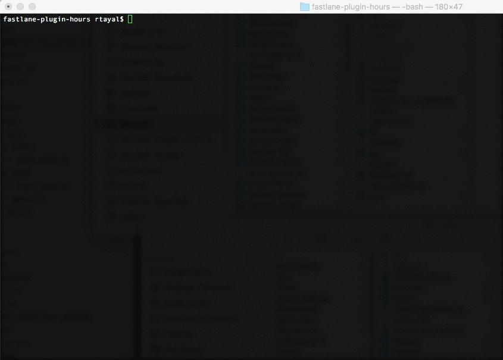

# hours plugin

[](https://rubygems.org/gems/fastlane-plugin-hours)
[](https://badge.fury.io/rb/fastlane-plugin-hours)
[](https://github.com/RishabhTayal/fastlane-plugin-hours/blob/master/LICENSE)


## Getting Started

This project is a [_fastlane_](https://github.com/fastlane/fastlane) plugin. To get started with `fastlane-plugin-hours`, add it to your project by running:

```bash
fastlane add_plugin hours
```

## About hours

Record total time saved by fastlane. It maintains a local file called `save_duration.txt` in the `fastlane` directory. When your run a lane it will calculate the time saved by `fastlane` and keep on adding it for your project.

**It does not track time on [hoursforteams.com](https://www.hoursforteams.com)**

## Example

Check out the [example `Fastfile`](fastlane/Fastfile) to see how to use this plugin. Try it by cloning the repo, running `fastlane install_plugins` and `bundle exec fastlane test`.

```ruby
before_all do
  hours(start_timing: true)
end

lane :release do
  gym
  deliver
end

after_all do |lane|
  hours(measure_timing: true)
end

```

Here is a gif showing what `hours` does:
<h3 alig="left">

</h3>


## Run tests for this plugin

To run both the tests, and code style validation, run

```
rake
```

To automatically fix many of the styling issues, use
```
rubocop -a
```

## Issues and Feedback

For any other issues and feedback about this plugin, please submit it to this repository.

## Troubleshooting

If you have trouble using plugins, check out the [Plugins Troubleshooting](https://docs.fastlane.tools/plugins/plugins-troubleshooting/) guide.

## Using _fastlane_ Plugins

For more information about how the `fastlane` plugin system works, check out the [Plugins documentation](https://docs.fastlane.tools/plugins/create-plugin/).

## About _fastlane_

_fastlane_ is the easiest way to automate beta deployments and releases for your iOS and Android apps. To learn more, check out [fastlane.tools](https://fastlane.tools).
